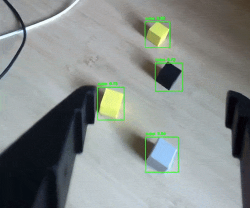

# cube-train-detect
Train a YOLO model to detect small cubes.

The cubes are small 20mm x 20mm 3D printed in several colours, the STL can be found [here](./stl/cube.stl). Included [in this repository](./data/) is a complete labeled dataset that can be used for training.

When trained the detect process can be run that will run inference in real time on the web camera feed.

## Dependencies

This project uses the [Pixi](https://pixi.sh/) package management tool, you will need to install this.

## Getting started

Clone the repo

    git clone https://github.com/lachlanhurst/cube-train-detect.git
    cd cube-train-detect

Install dependencies

    pixi install

## Capturing data

Run the following command to start the capture process, assumes web camera is connected

    pixi run main capture

Press the space bar to capture what is currently shown in the popup window. Images are saved to the `./captures` folder. Press 'q' to stop the process.

## Labelling

There's a full labelled dataset in the `./data` folder. If you'd like to generate you own I suggest using [Label Studio](https://labelstud.io/).

## Training

Run the following command to start the training process. It assumed labelled dataset is the one included in `./data`, but this can be overriden via command line args (refer `pixi run main capture --help`)

    pixi run main train --device mps -d data/cubes_on_desk_dataset.yaml

In a separate terminal tensorboard can be used to monitor progress

    pixi run tensorboard

## Detecting

Run the following command to start the detection process, assumes web camera is connected and you have a trained model.

    pixi run main detect -mp path/to/trained/weights/best.pt
